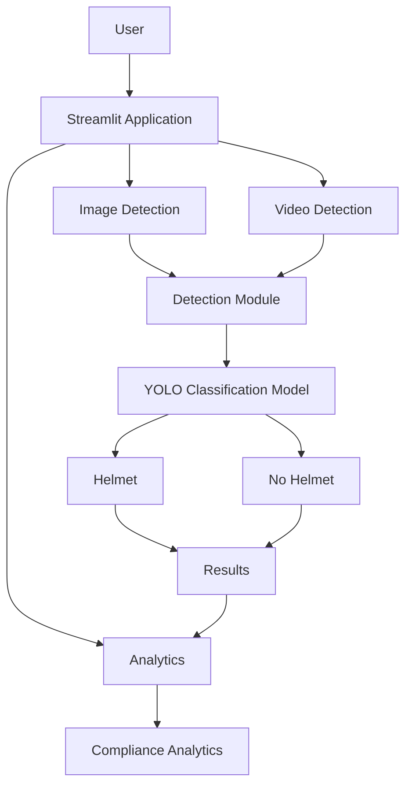
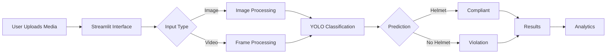

# 🦺 AI-Based Helmet Compliance Monitoring System

---

## 📌 Overview

**AI-Based Helmet Compliance Monitoring System** is a computer-vision application designed to automate helmet compliance checking using a custom-trained **YOLO classification model**.

The system analyzes uploaded images and videos and determines whether helmet safety requirements are being followed. The results can then be explored through the application's analytics interface.

The project combines **deep learning, computer vision, Python, and Streamlit** to provide an accessible interface for AI-powered safety monitoring.

> 🎯 **Goal:** Reduce the dependency on manual inspection by using computer vision to assist in identifying helmet compliance.

---

## 🚀 Live Demo

Experience the application directly:

### 👉 [Launch Helmet Compliance Monitoring System](https://helmet-compliance-monitoring-v2-za9mkf4sb9wdwahpqm33oj.streamlit.app/)

---

## ✨ Features

### 🖼️ Image Detection

Upload an image and analyze helmet compliance using the trained YOLO classification model.

The system identifies classes including:

- 🟢 **Helmet**
- 🔴 **No Helmet**

---

### 🎥 Video Detection

Upload a video and analyze helmet compliance frame-by-frame.

The application processes the uploaded video using the computer-vision pipeline and generates the corresponding detection results.

---

### 📊 Analytics Dashboard

The project includes an analytics component for visualizing helmet compliance information and safety-related statistics.

This allows users to move beyond individual predictions and understand the overall detection results.

---

### 🧠 Custom YOLO Classification

The project uses a custom-trained **Ultralytics YOLO classification model** for helmet compliance classification.

The repository contains trained model files and the training script used for the machine-learning workflow.

---

### ☁️ Streamlit Deployment

The application is deployed using **Streamlit Cloud**, providing a browser-based interface for interacting with the trained model.

---

## 🧩 How It Works

```text
              ┌──────────────────────┐
              │   Image / Video      │
              │       Input          │
              └──────────┬───────────┘
                         │
                         ▼
              ┌──────────────────────┐
              │   Preprocessing &    │
              │   Input Handling     │
              └──────────┬───────────┘
                         │
                         ▼
              ┌──────────────────────┐
              │    YOLO Classifier   │
              │  Custom Trained ML   │
              │        Model         │
              └──────────┬───────────┘
                         │
                         ▼
              ┌──────────────────────┐
              │  Helmet / No Helmet  │
              │      Prediction      │
              └──────────┬───────────┘
                         │
                         ▼
              ┌──────────────────────┐
              │ Detection Results &  │
              │      Analytics       │
              └──────────────────────┘

```

---

## 🏗️ Architecture

The application follows a modular Python structure separating the user interface, detection logic, analytics, database functionality, configuration, models, and utility functions.



---

## 🧠 Machine Learning Pipeline

The machine-learning workflow follows the following stages:

```text
Dataset
   ↓
Data Preparation
   ↓
YOLO Classification Training
   ↓
Model Evaluation
   ↓
Trained Model
   ↓
Application Integration
   ↓
Helmet Compliance Prediction

```

The repository includes:

- `train_model.py` — model training script
- `models/` — model-related files
- `runs/classify/train/` — training outputs
- `yolo11n-cls.pt` — YOLO classification model
- `yolov8n.pt` — YOLO model file

---

## 🛠️ Technology Stack

| TechnologyPurpose       |                               |
| ----------------------- | ----------------------------- |
| 🐍 **Python**           | Core programming language     |
| 🎈 **Streamlit**        | Web application interface     |
| 🧠 **Ultralytics YOLO** | Helmet classification         |
| 👁️ **OpenCV**          | Image and video processing    |
| 🔢 **NumPy**            | Numerical computation         |
| 🐼 **Pandas**           | Data processing and analytics |
| ☁️ **Streamlit Cloud**  | Application deployment        |
| 📓 **Google Colab**     | Model training environment    |

---

## 📂 Project Structure

```text
helmet-compliance-monitoring/
│
├── analytics/
│   └── Analytics and data visualization
│
├── assets/
│   └── Application assets
│
├── config/
│   └── Configuration files
│
├── database/
│   └── Database-related functionality
│
├── detection/
│   └── Helmet detection and classification logic
│
├── helmet_dataset/
│   └── Helmet classification dataset
│
├── models/
│   └── Model-related files
│
├── outputs/
│   └── Generated detection outputs
│
├── pages/
│   └── Streamlit application pages
│
├── runs/
│   └── Model training outputs
│
├── uploads/
│   └── Uploaded media
│
├── utils/
│   └── Utility/helper functions
│
├── app.py
│   └── Main Streamlit application
│
├── train_model.py
│   └── Model training script
│
├── requirements.txt
│   └── Python dependencies
│
├── yolo11n-cls.pt
│   └── YOLO classification model
│
└── yolov8n.pt
    └── YOLO model

```

---

## 💻 Installation

### 1. Clone the Repository

```bash
git clone https://github.com/abdulazizmuskan/helmet-compliance-monitoring.git
cd helmet-compliance-monitoring

```

### 2. Create a Virtual Environment

#### Windows

```bash
python -m venv venv
venv\Scripts\activate

```

#### macOS / Linux

```bash
python3 -m venv venv
source venv/bin/activate

```

### 3. Install Dependencies

```bash
pip install -r requirements.txt

```

### 4. Run the Application

```bash
streamlit run app.py

```

The application will open in your browser.

---

## 📖 Usage

### Image Classification

1. Launch the Streamlit application.
2. Navigate to the **Image Detection** section.
3. Upload an image.
4. Run the detection process.
5. Review the helmet compliance prediction.

### Video Classification

1. Navigate to the **Video Detection** section.
2. Upload a video.
3. Allow the application to process the video.
4. Review the generated detection results.

### Analytics

Navigate to the **Analytics** section to explore the available compliance statistics and visualizations.

---

## 📊 Detection Classes

| ClassDescription |                                                   |
| ---------------- | ------------------------------------------------- |
| 🟢 **Helmet**    | Helmet detected / compliant classification        |
| 🔴 **No Helmet** | No helmet detected / non-compliant classification |

---

## 📁 Dataset

The project uses a **Helmet Detection Dataset from Kaggle** for training the classification model.

The dataset is organized within the project under:

```text
helmet_dataset/

```

The trained model is then integrated into the application for inference.

---

## 🔬 Model Training

The repository includes a dedicated training script:

```text
train_model.py

```

The general workflow is:

```text
Helmet Dataset
      ↓
Training
      ↓
YOLO Classification Model
      ↓
Evaluation
      ↓
Trained Weights
      ↓
Streamlit Application

```

Training outputs are maintained under:

```text
runs/classify/train/

```

---

## 🎯 Project Objectives

The primary objectives of this project are:

- Automate helmet compliance checking using computer vision.
- Apply deep-learning-based image classification to safety monitoring.
- Provide image and video analysis through an easy-to-use interface.
- Present compliance information through analytics.
- Demonstrate the practical integration of a trained AI model into a web application.

---

## 🌟 Why This Project?

Helmet compliance is an important aspect of workplace and road safety. Traditional monitoring often relies heavily on manual observation, which can be time-consuming and difficult to scale.

This project demonstrates how **AI and computer vision can assist safety monitoring workflows** by automatically analyzing visual data and identifying helmet compliance.

It brings together:

```text
Computer Vision
       +
Deep Learning
       +
Python
       +
YOLO
       +
Streamlit
       +
Analytics

```

into a single application.

---

## ⚙️ Application Workflow



---

## 🔮 Future Improvements

Potential improvements for future versions include:

- Improved model performance with a larger and more diverse dataset.
- Better handling of challenging lighting and image conditions.
- More detailed compliance reporting.
- Expanded analytics and visualization.
- Improved user interface and overall user experience.

---

## ⚠️ Responsible Use

This project is intended as an **AI-assisted safety monitoring system**.

Computer-vision predictions can be affected by factors such as image quality, lighting, camera angle, occlusion, and dataset limitations. Therefore, predictions should be treated as an aid to safety monitoring rather than an infallible decision-making system.

---

## 👨‍💻 Author

### Muskan Abdul Aziz

Computer Science & Engineering

---

## ⭐ Support

If you found this project interesting, consider giving the repository a ⭐ on GitHub.
